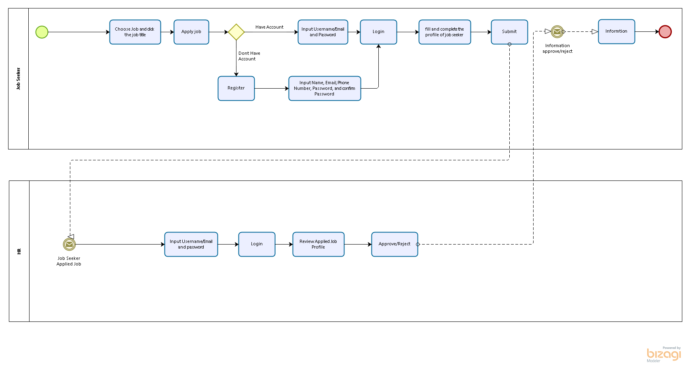

# Job-Registration-Submisson

<b> Job Regitration Submisson</b> merupakan aplikasi yang digunakan untuk para pekerja yang ingin melamar pekerjaan. Pelamar pekerjaan dapat memilih pekerjaan yang dia minati dan mengisi profil yang nantinya dijadikan bahan pertimbangan oleh pihak perusahaan. Aplikasi akan secara otomatis mengirim data pelamar jika pelamar menekan tombol submit melalui email.  
Kemudian pihak perusahaan akan menerima data yang dikirimkan pelamar dan mempertimbangkan data yang dikirim. kemudia pihak perusahaan dapat menerima dan menolak pelamar, dan aplikasi akan memberitahukan aplikasi kepada pelamar melalui email perihal diterima atau ditolak lamaran tersebut.

## Business Process Model Notation (BPMN)

## Entity Relationship Diagram (ERD)

## UseCase

## Implementasi Pada Aplikasi ini
o	OOP (Object Oriented Programming)  
o	WEB API  
o Penggunaan Repo Pattern  
o	JWT (Json Web Tokens)  
o Web Clinet (MVC)  
o	Web Template (CSS, Bootstrap)  
o	JavaScript  
o	Error Handling  
